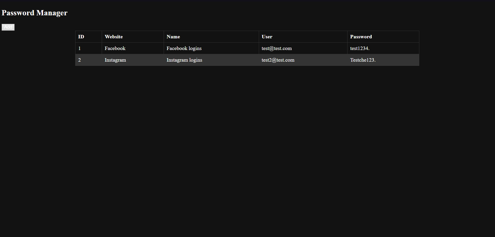
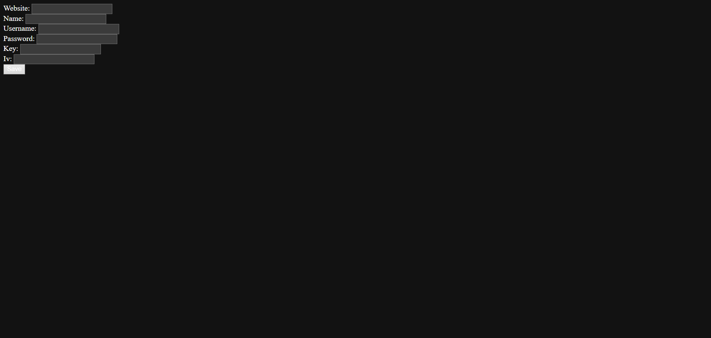
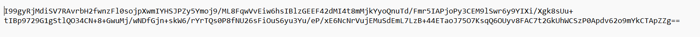

# SecurePass - Self-Hosted Password Manager

SecurePass is a self-hosted password manager designed to provide secure and convenient access to your encrypted passwords from anywhere in the world. The app features a backend in ASP.net and a simple Single Page Application (SPA) for the front end using HTML, CSS, and JavaScript.

## Features
- **Encryption**: Encrypt and decrypt passwords using a specified key and initialization vector (IV).
- **Remote Access**: Store the app on a remote USB for convenient access to your passwords from any device.
- **Add and Save Passwords**: Easily add and save passwords with confidence in their encryption.
- **USB Encryption**: For more protection you can easily BitLock your remote USB with a passwords, as well as limit the passwords.txt file deletion.

## Use
1. For the unique Key which is Base64-encoded key you will have to use 64 based encoded string that has padding at the end, for example: "4qYnaHLMCL/3btlRrdT6z8/XW8zwtYYaf5P7B6Hcdz0="
2. For the unique Iv which is initialization vector you will have to use 64 based encoded string that has padding at the end, for example: "8q3l5CFrFnQ9CrOlvBChCz=="
3. Once you login with your Key and Iv you will be able to see your decrypted data. You can encrypt and decrypt data with different Key and IV.

## Installation

1. Clone the repository to your server.
   ```bash
   git clone https://github.com/AlexanderNovoselski/Password-Manager
2. Open the start_servers.bat file and Change to your project directory 
3. Run the .bat file, this will automatically download needed dependencies: { .NET SDK, Node.js}
4. The app will automatically start once everything has been downloaded and installed, on a url http://localhost:5000/index.html

## Screenshots


*Caption: SecurePass Login Page*


*Caption: List of encrypted passwords*


*Caption: Adding a new password*


*Caption: Encrypted .txt file*

## Contact and Feedback

For any bugs, issues, or feature requests, please feel free to contact me via email:

- Email: [alexandernovoselski@yahoo.com](mailto:alexandernovoselski@yahoo.com)
